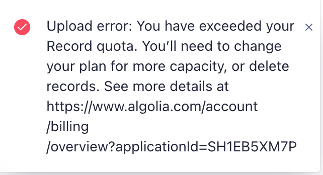

# Algolia Take Home Assignment

Website: [calrueb.github.io/algolia/](https://calrueb.github.io/algolia/)

Data source: [CORGIS Dataset Project](https://corgis-edu.github.io/corgis/json/billionaires/)

Customer response portion: [link](customer_questions.md)

## About my app

I built a fake Forbes billionaire list using a net worth dataset I found online. A user can search by either _name_ or _rank_ to find relevant results.

There was one interesting challenge with this dataset I did not expect. The dataset included the billionaire lists from 1996, 2001, and 2014. For example, Bill Gates appeared three times in the dataset. I was able to use the "Deduplication and grouping" features when configuring my index so that search would only return one Bill Gates record.

## Feedback

My feedback is overwhelmingly positive. I spent more time fiddling with my React app, then I did in the Algolia dashboard. I am amazed how easy, and intuitive it is to build a high performant search index. The UI was great, and customizing my index was easy. I was very impressed by the speed of how quickly index updates were applied.

### My only issue:

When I first got started I initially uploaded a different dataset which had over 10,000 records. I did this via the UI, and I knew from the docs that this should be okay for free users; if a dataset with over 10,000 records is uploaded then Alogia will happily index the first 10,000.

However, when I uploaded my data there was a red error that appeared, but the user flow I was in did not suggest that the first 10,000 records had ingested. I ended up leaving, finding a new smaller dataset, and when I came back to upload the new dataset I saw 10,000 records from my original dataset had successfully been added.

I wasn't able to repo the issue later on, but I believe I was in some sort of new-user/quick start flow.
